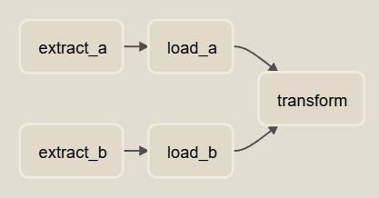

# Data Pipeline with Airflow

## Introduction

Apache Airflow is an open-source platform designed to facilitate and automate complex workflows in data engineering, data science, and beyond. Developed by Airbnb and later open-sourced, it has become an essential tool in the field of data orchestration. Airflow allows users to define, schedule, monitor, and execute workflows as directed acyclic graphs (DAGs), making it easier to manage and automate various tasks and dependencies. Its flexibility, extensibility, and a wide range of pre-built operators for various systems and services make it a powerful choice for orchestrating and automating diverse data pipelines, ETL (Extract, Transform, Load) processes, and other workflow automation needs. Whether you're managing data pipelines or coordinating a series of tasks, Apache Airflow provides a reliable and scalable framework to streamline your workflow management and automation processes.


## Pipelines

In this project, The following pipelines are implemented:

  - **user_processing**: A regular pipeline that demonstrates the uses of Airflow Operators, Sensors, and Hooks.

    

  - **parallel_dag**: The DAG that demonstrates two parallel pipelines operate concurrently

    

  - **producer and consumer**: A pipeline that demonstrates using a `Dataset` as consumer's trigger schedule

    - Producer DAG:


        

    - Consumer DAG:

        

  - **group_dag**: A pipeline that demonstrates using `SubDagOperator` or new `TaskGroup` for grouping similar tasks together to ease dag management.

    - Group Tasks with `SubDagOperator`:

        

    - Group Tasks with `TaskGroup`:

        

  - **xcom_dag**: A pipeline that demonstrates using `XCom` to exchange data between different tasks and the branch operator to enable conditional path selection.

    

  - **elastic_dag**: A pipeline that demonstrates using a custom plugin to communicate with elasticsearch server.

    


## How to run the project

For DAGs other than `elastic_dag`:

1. Spin up docker-compose at the root of the project directory:

    ``` bash
    $<project_directory> docker-compose up -d
    ```

    Otherwise,

    ``` bash
    $<project_directory> docker-compose -f docker-compose-es.yaml up -d
    ```

2. Create connections as follows:


3. Ready to trigger the pipeline
